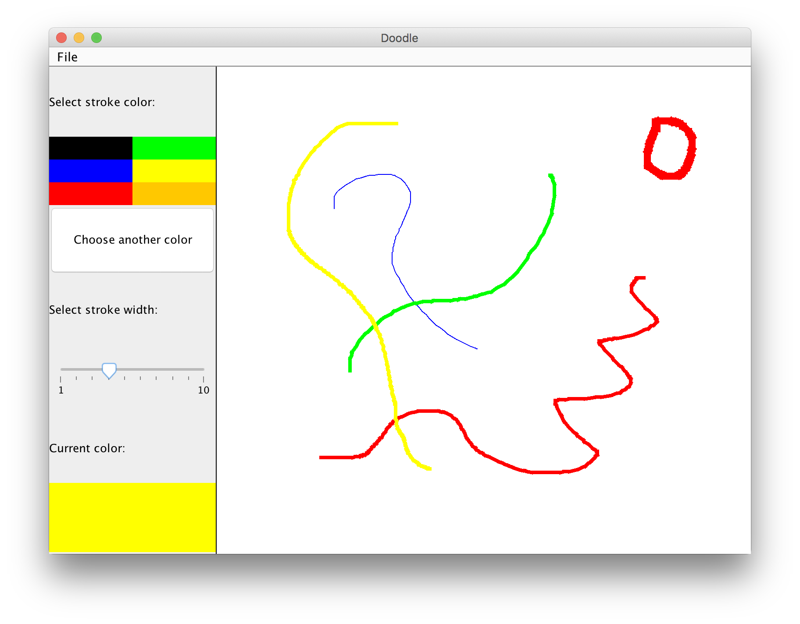

# Doodle (MVC in Java)

## Description

- This implementation is partial.

## Get Started

- run with `./gradlew run`.

## Available Functions

### Menu Bar [partial]

- Including menu bar, menu items with save, load, create and eit.
- save and load can display JFileChooser but unable to actually save and load content.
- create is not implemented.
- exit is implemented.

### Color Palette

- Default 6 colors to choose from: black, green, blue, yellow, read and orange.
- The 7th button will open JColorChooser and let the user to choose other colors.
- A slider is used to control width of the strokes, with min size 1 and max size 10.
- The current selected color will be displayed at the bottom of this panel.

### Canvas

- Drawings are fully implemented with each stroke separate with its own properties (color and width, drawing path).

### Dynamic Layout

- The window support resizing with minimum width `400` and minimum height `300`, given implemented features.

## Unimplemented Functions

### Playback

- N/A

### Enhancements

- N/A
